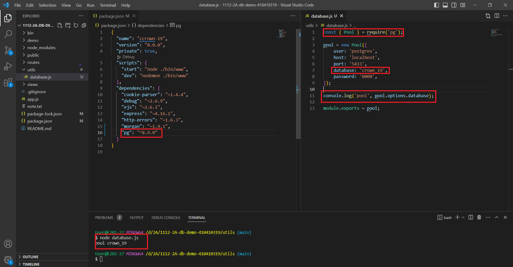
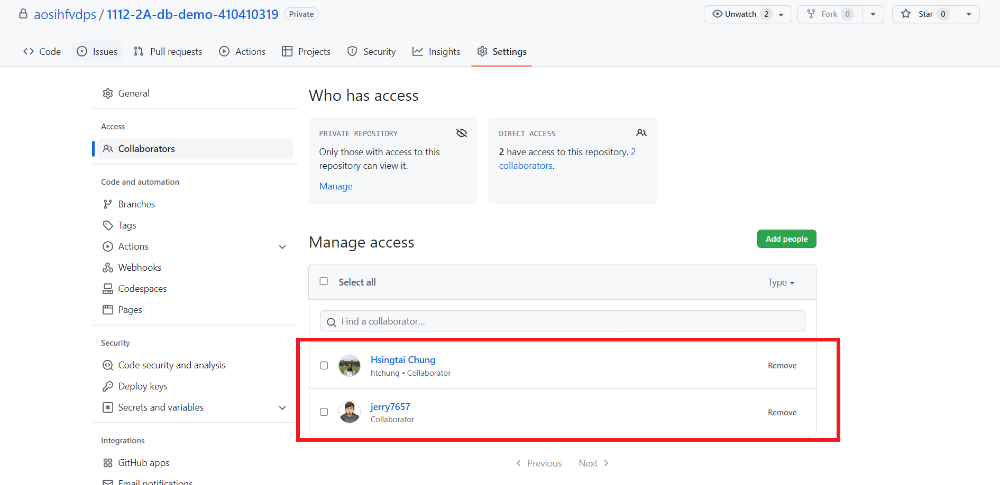
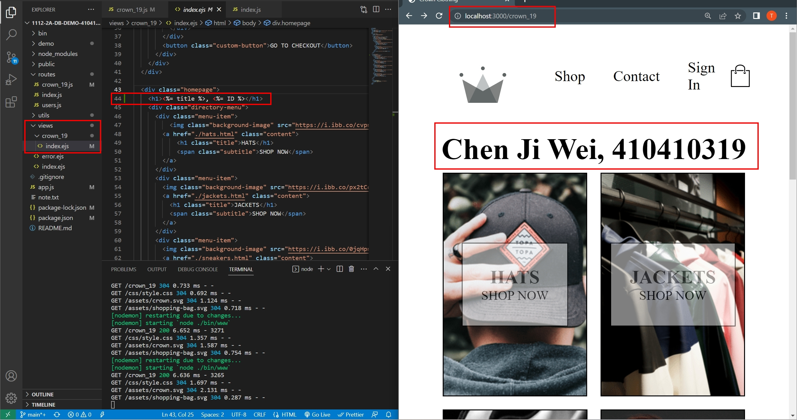
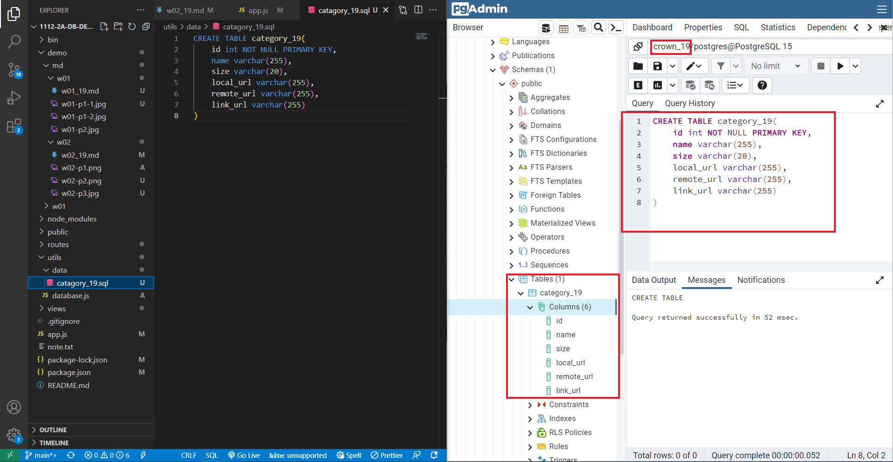
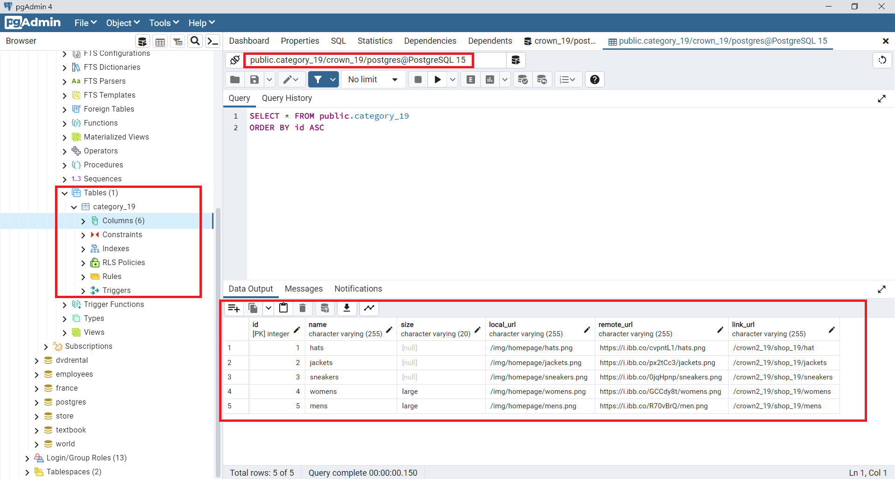
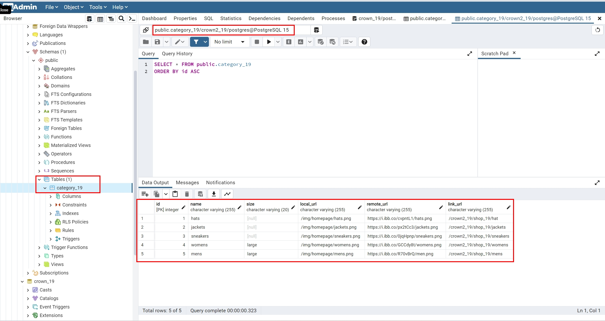

[My Github repo URL](https://github.com/htchung/1112-2A-db-demo-id)

### W02-P1: 資料庫連線及測試連線，要顯示資料庫 crown_36 名稱



### W02-P2:邀請老師與助教



### W02-P3: 建立路由 /crown_36 顯示 crown_36/index.ejs



### W02-P4:說明 pgAdmin 4 路徑設設定



### W02-P5: insert 5 data into category_36 using SQL command



### W02-P6: backup crown_36 database, and restore the data into another database crown2_36



### W02-P7: 將取得json資料套運在crown_36/index.ejs上

### Github logs of Week 02

```
$ git log --pretty=format:"%h%x09%an%x09%ad%x09%s" --after="2023-2-21"
c4b2eca htchung Thu Feb 23 13:10:51 2023 +0800  add dev/w02-db code for week 2 classdemo
098178c htchung Wed Feb 22 15:02:29 2023 +0800  W02-P3: 建立路由 /crown_xx 顯示 crown_xx/index.ejs
5fa19d5 htchung Wed Feb 22 13:18:26 2023 +0800  add demo/w11 code
738f5e7 htchung Wed Feb 22 12:33:43 2023 +0800  add dev/1102 classdemo
```
