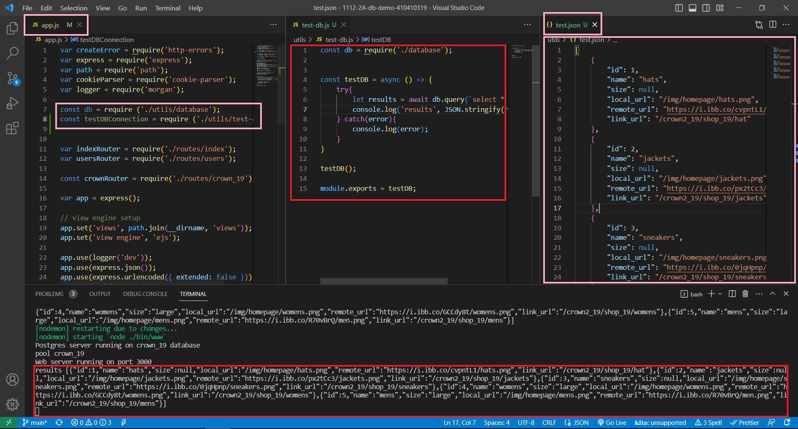
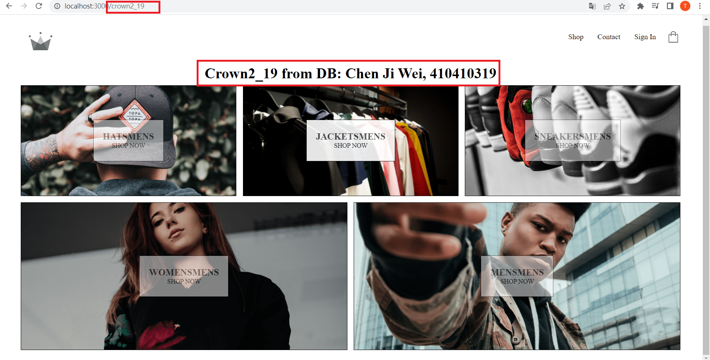
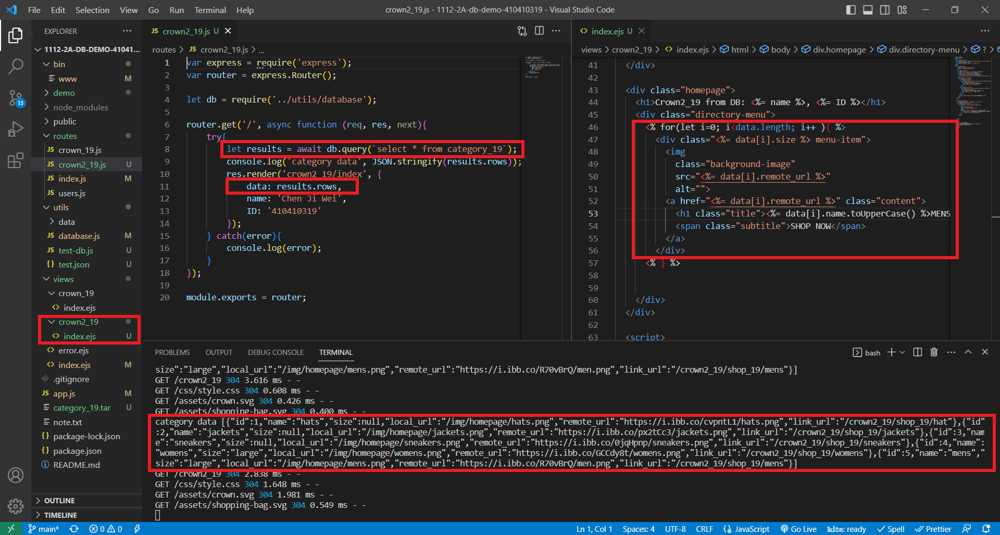

### W03-P1: test-db.js can retrieve 5 data of category_xx tables



### W03-P2: fetch category data and replace crown2_xx/index.ejs with these data





### Github logs of Week 01~03


```
$ git log --pretty=format:"%h%x09%an%x09%ad%x09%s" --after="2023-2-13"
22a3005 aosihfvdps      Tue Feb 28 22:21:58 2023 +0800  0228 - 2210
bd4b043 aosihfvdps      Tue Feb 28 21:40:05 2023 +0800  0228 - 2140
87f9ed7 aosihfvdps~     Thu Feb 23 18:02:51 2023 +0800  This update is at 2023 0223 1802
3234ca4 aosihfvdps      Wed Feb 22 13:30:32 2023 +0800  add demo/w01
64d7ffa aosihfvdps      Tue Feb 21 00:19:59 2023 +0800  add demo/md/w01 files
aeb2598 aosihfvdps      Tue Feb 21 00:02:54 2023 +0800  copy crown theme files to public folder
6c88160 aosihfvdps      Mon Feb 20 22:03:29 2023 +0800  w01 first commit
6bb8073 aosihfvdps      Mon Feb 20 21:48:30 2023 +0800  Initial commit
```
