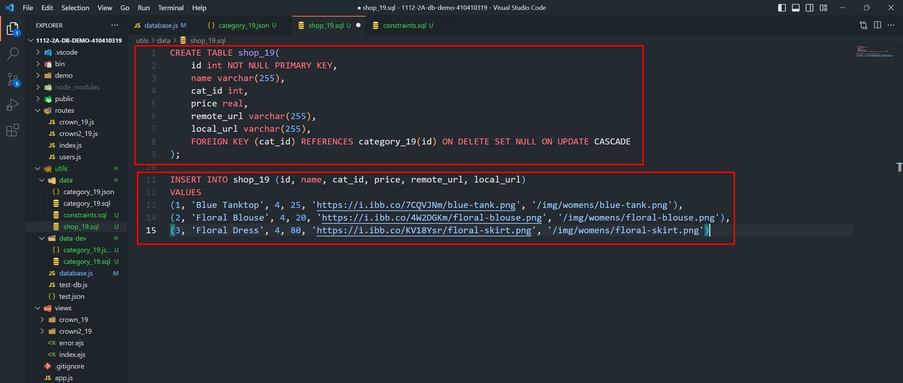

### W06-P1: use SQL command to create shop_xx with 3 data (category is your ID's last digit)

 

### W06-P2: Relational Model Constraints
 
定義域限制 (domain constraints)

 
關聯鍵限制 (primary key constraints)

 
實體完整限制 (entity integrity constraitns)

 
參考完整限制 (referential integrity constraint)

### W06-P3: ON UPDATE CASCASE
 

 

### W06-P4: ON DELETE SET NULL
 

 
